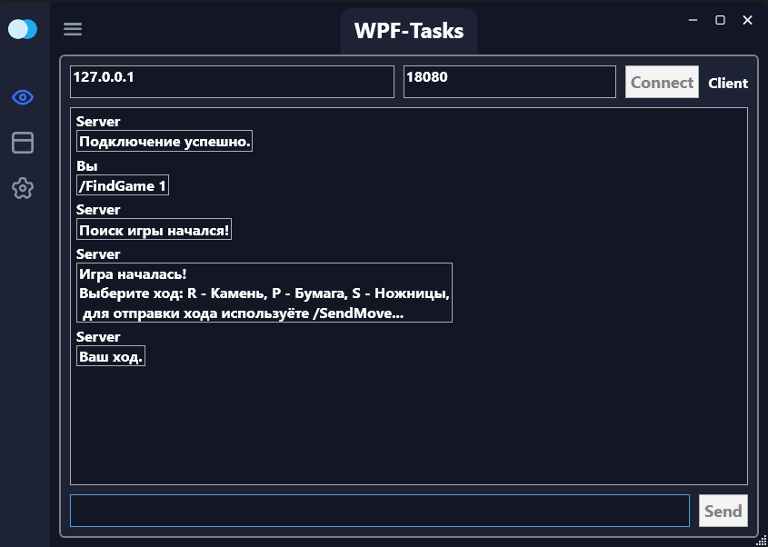
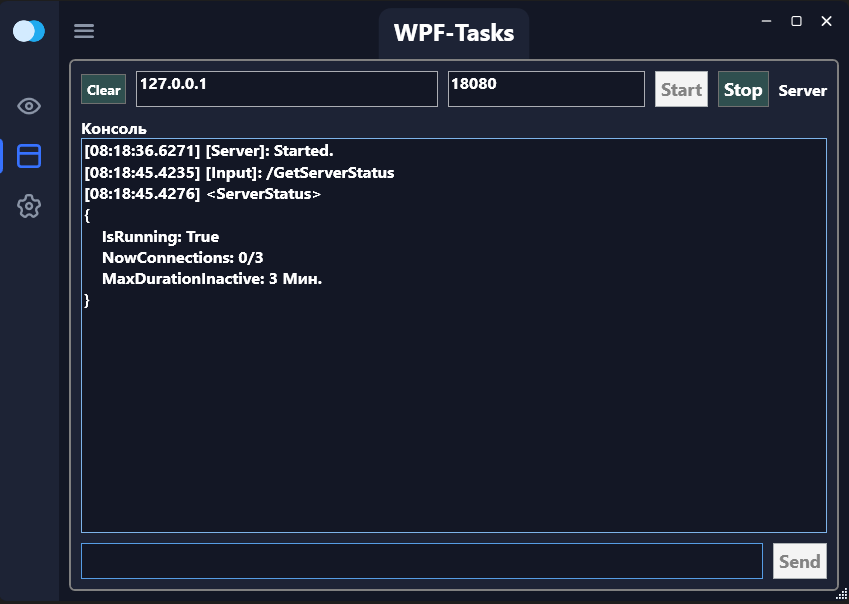

# Камень, ножницы, бумага

## Описание

Данный проект представляет собой сетевую игру «Камень, ножницы, бумага», реализованную на основе архитектуры MVVM. Игра поддерживает три режима:
- **Человек – Человек**
- **Человек – Компьютер**
- **Компьютер – Компьютер**

В основе реализации лежит RequestResponseServer (RrServer) и система MessageBuilder для упаковки и распаковки сообщений, что позволяет обмениваться данными между клиентом и сервером. Логика игры проста: оба игрока одновременно выбирают один из вариантов (0 — Камень, 1 — Бумага, 2 — Ножницы), и по стандартным правилам определяется победитель.

## Структура проекта

- **Модели (Models)**  
  Содержат реализацию клиентской и серверной логики, а также игровые сессии и игроков (например, `OnlinePlayer` и `ComputerPlayer`).

- **MessageBuilder**  
  Набор классов для формирования сообщений (например, `FindGameRequestMsgBuilder`, `UserMoveMsgBuilder`, `RoundResultMsgBuilder` и др.), используемых для обмена информацией между клиентом и сервером.

- **Сервисы (Services)**  
  Реализуют логику игры и управление сессиями, включая поиск игр и обработку ходов.

- **ViewModels (VM)**  
  Реализация MVVM для клиентского и серверного интерфейсов, предоставляющая удобный способ взаимодействия пользователя с игрой через консоль.

## Как запустить

1. **Сборка проекта:**  
   Откройте решение в Visual Studio (или используйте любой другой IDE, поддерживающий .NET) и соберите проект. Требуется .NET 6 или выше.

2. **Запуск сервера:**  
   Запустите серверное приложение из специальной вкладки.

3. **Запуск клиента:**  
   Запустите клиентское приложение из специальной вкладки.

4. **Управление игрой:**  
   Используйте следующие команды:
   - `/FindGame <Type>` – начать поиск игры (0 – Human-Human, 1 – Human-Computer, 2 – Computer-Computer).
   - `/SendMove <Move>` – отправить ход (0 — Камень, 1 — Бумага, 2 — Ножницы).
   - `/GiveUp` – сдаться.
   - `/SuggestDraw` – предложить ничью.
   - `/GetInstructions` – получить инструкции по игре.

## Скриншоты

### Клиентское приложение

### Серверное приложение

## Команды для управления игрой

- **/Connect**  
  Пример: `/Connect 127.0.0.1 8080`

- **/FindGame**  
  Пример: `/FindGame 0`  
  (где `0` соответствует игре Человек–Человек, `1` — Человек–Компьютер, `2` — Компьютер–Компьютер)

- **/SendMove**  
  Пример: `/SendMove 1`  
  (где `0` — Камень, `1` — Бумага, `2` — Ножницы)

- **/GiveUp**  
  Пример: `/GiveUp`

- **/SuggestDraw**  
  Пример: `/SuggestDraw`

- **/GetInstructions**  
  Пример: `/GetInstructions`

## Лицензия

Этот проект распространяется под лицензией [MIT License](LICENSE).
